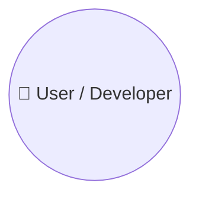
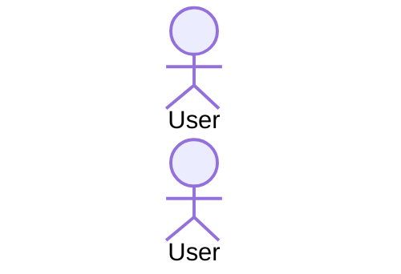

# {Framework Name} — Analysis

> {One-sentence summary of what this framework is and what it provides.}

---

## Table of Contents

- [1. What Is This Framework?](#1-what-is-this-framework)
- [2. Helicopter View](#2-helicopter-view)
- [3. Playbook — How to Use the Framework](#3-playbook--how-to-use-the-framework)
- [4. Component Catalog](#4-component-catalog)
- [5. Component Categories](#5-component-categories)
- [6. Detailed Component Descriptions](#6-detailed-component-descriptions)
- [7. Interaction & Dependency Map](#7-interaction--dependency-map)
- [8. Workflow Pipelines (End-to-End)](#8-workflow-pipelines-end-to-end)
- [9. Shared Resources & Conventions](#9-shared-resources--conventions)
- [10. Tool Access Matrix](#10-tool-access-matrix)
- [11. Strengths, Limitations & Comparison Notes](#11-strengths-limitations--comparison-notes)

---

## 1. What Is This Framework?

{2-3 paragraph description: what it is, who built it, what problem it solves, what IDE/tool it targets.}

### What Problems Does It Solve?

| Problem | How the Framework Addresses It |
|---------|-------------------------------|
| {Problem 1} | {Solution 1} |

### Architecture Overview

| Layer / Building Block | Purpose | Contents |
|------------------------|---------|----------|
| {Layer 1} | {What it does} | {Key files} |

### File Structure

```
{project-root}/
├── {file or dir}          ← {role/purpose}
└── {file or dir}/
    └── {file}             ← {role/purpose}
```

---

## 2. Helicopter View



### Core Design Principles

| Principle | Description |
|-----------|-------------|
| {Principle 1} | {Description} |

---

## 3. Playbook — How to Use the Framework

### Quick Reference: "I Want To..."

| I Want To... | Start With | Workflow |
|-------------|-----------|---------|
| {Goal 1} | {Entry point} | {Workflow description} |

### Scenario 1: {Scenario Name}

**When:** {When to use this scenario.}

**Steps:**

```
  Step 1 │  {Description}
         │
  Step 2 │  {Description}
```

---

## 4. Component Catalog

| # | Component | File | Category | Description |
|---|-----------|------|----------|-------------|
| 1 | {Name} | `{filename}` | {Category} | {Description} |

---

## 5. Component Categories

```mermaid
mindmap
  root(("{Framework Name}"))
    {Category 1}
      {Component A}
```

### Category Definitions

| Category | Purpose | Interaction Style | Output |
|----------|---------|-------------------|--------|
| {Category 1} | {What it does} | {How user interacts} | {What it produces} |

---

## 6. Detailed Component Descriptions

### 6.1 {Component Name}

| Property | Value |
|----------|-------|
| **Role** | {What this component does} |
| **Type** | {Agent / Instruction / Prompt / Skill} |
| **File** | `{path/to/file}` |
| **Key Behavior** | {Most important characteristic} |
| **Output** | {What it produces} |

---

## 7. Interaction & Dependency Map

```mermaid
flowchart TD
    %% Adapt to framework specifics
```

---

## 8. Workflow Pipelines (End-to-End)

### 8.1 {Pipeline Name}



---

## 9. Shared Resources & Conventions

### 9.1 Naming Conventions

{File naming patterns, frontmatter conventions.}

### 9.2 Output Structure

```
{output-root}/
├── {dir}          ← {purpose}
```

---

## 10. Tool Access Matrix

| Component | {Tool 1} | {Tool 2} |
|-----------|----------|----------|
| {Comp A} | ✅ | ❌ |

---

## 11. Strengths, Limitations & Comparison Notes

### Strengths

| Strength | Details |
|----------|---------|
| {Strength 1} | {Why it matters} |

### Limitations

| Limitation | Details |
|------------|---------|
| {Limitation 1} | {Impact} |

---

## Summary

- **{Key takeaway 1}**
- **{Key takeaway 2}**
