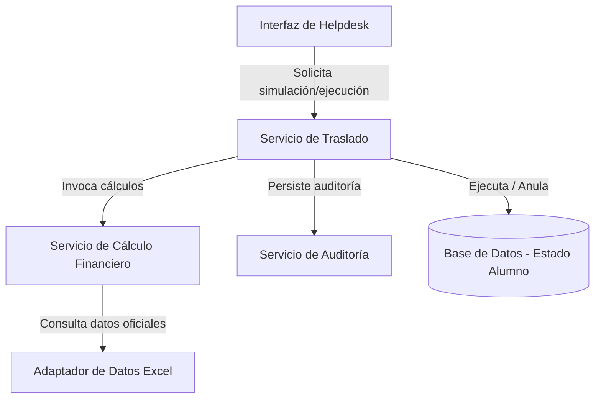

# plan.md

## Resumen técnico

La feature de "Traslado de Estudiantes Vonex" requiere un motor financiero altamente determinista y centralizado que gestione la lógica de saldo residual origen, costo residual destino, exoneraciones y costos administrativos. La solución se diseñará bajo una arquitectura de capas bien diferenciadas, donde la lógica de negocio estará completamente aislada del mecanismo de persistencia y de la interfaz de presentación. Toda la programación académica proviene de una estructura inmutable derivada del Excel oficial (fuente de datos oficial previamente cargada), y cada acción transaccional (ejecución, aceptación/rechazo de deuda, o anulación) persistirá en una bitácora inmutable de auditoría para garantizar la trazabilidad operacional y financiera exigida.

## Arquitectura propuesta

Se propone una arquitectura desacoplada basada en servicios de dominio y adaptadores de datos:

*   **Capa de Dominio (Pureza Financiera)**: El motor de cálculo (`TrasladoCalculator`) recibe entradas primitivas estructuradas y determina los resultados residuales sin acceder a la base de datos o APIs directamente, asegurando determinismo y testabilidad.
*   **Capa de Aplicación (Orquestación)**: El servicio de traslados coordina las solicitudes de Helpdesk, valida precondiciones, almacena auditorías y actualiza el estado de la matrícula.
*   **Capa de Adaptadores (Infraestructura)**: Consume la fuente de datos oficial del Excel de programación académica cargada en memoria o en una base de datos relacional de solo lectura durante el flujo de traslados.

## Componentes

### 1. Servicio de cálculo financiero (`TrasladoCalculator`)
*   **Responsabilidad**: 
    - Calcular el saldo residual del ciclo de origen en modalidad contado (RN-04) aplicando la fórmula: `Monto pagado contado ÷ semanas totales del ciclo × semanas restantes`.
    - Calcular el saldo residual o devengado en modalidad cuotas (RN-05, RN-09), respetando las reglas de la semana marketera (donde no se descuenta valor hasta el miércoles de la segunda semana administrativa).
    - Calcular el costo residual del ciclo destino en base a la modalidad de destino.
    - Determinar la aplicación o exoneración del costo administrativo de S/20 (RN-14, RN-15) según la fecha efectiva de traslado, los calendarios del ciclo destino, y la fecha de matrícula del estudiante.
    - Resolver el balance neto (`Resultado = Saldo residual origen − costo residual destino − costo administrativo`).
*   **Riesgo asociado**: Inconsistencias de cálculo por diferencias horarias o mala interpretación de los calendarios académico (lunes a viernes) vs. administrativo (jueves a miércoles).

### 2. Servicio de ejecución de traslado (`TrasladoService`)
*   **Responsabilidad**:
    - Validar precondiciones de negocio (por ejemplo, que el ciclo de destino no haya finalizado).
    - Evaluar la decisión del estudiante ante saldos negativos (RN-13) y bloquear la ejecución si hay rechazo.
    - Modificar atómicamente la matrícula del estudiante del ciclo origen al ciclo destino.
    - Aplicar excedentes a cuotas futuras (RN-11) y registrar la auditoría.

### 3. Servicio de anulación (`AnulacionService`)
*   **Responsabilidad**:
    - Validar que el traslado previo exista y esté en estado "Ejecutado".
    - Revertir de forma atómica los cambios de saldo e inscripción del estudiante retornándolo a su estado previo.
    - Registrar la anulación y asociar el identificador del correo de solicitud de anulación del estudiante (RN-16).

### 4. Servicio de auditoría (`AuditoriaService`)
*   **Responsabilidad**:
    - Registrar de forma inmutable cada simulación, aprobación, ejecución, rechazo y anulación.
    - Persistir todos los datos requeridos por la regla RN-17, incluyendo marcas de tiempo y el usuario operador de Helpdesk.

### 5. Adaptador de datos institucionales (`ProgramacionAcademicaRepository`)
*   **Responsabilidad**:
    - Proveer los datos de ciclos, calendarios, tarifas, cuotas y semanas marketeras importados del Excel oficial.
    - Garantizar que la interfaz expuesta sea de solo lectura para evitar modificaciones manuales o ad hoc durante el flujo.

## Riesgos y mitigaciones

*   **Riesgo 1: Inconsistencia entre fórmulas implementadas (Contado vs Cuotas)**
    - *Mitigación*: Centralizar todo el cálculo en el motor `TrasladoCalculator` de manera que no existan implementaciones paralelas en handlers o controladores. El motor será probado unitariamente bajo múltiples permutaciones de fechas.
*   **Riesgo 2: Cambios futuros en las reglas de prorrateo o calendarios**
    - *Mitigación*: Implementar el motor de cálculo utilizando el patrón Estrategia (`Strategy Pattern`), permitiendo inyectar diferentes algoritmos de prorrateo (con o sin semana marketera, contados o cuotas) según los atributos del ciclo recuperados por el adaptador.
*   **Riesgo 3: Errores derivados de la lógica de la semana marketera en modalidad cuotas**
    - *Mitigación*: Diseñar pruebas unitarias específicas con fechas límite (miércoles de la segunda semana administrativa a las 23:59:59 vs. jueves de la segunda semana a las 00:00:00) para garantizar que el valor de la cuota se conserve íntegro y que el prorrateo comience exactamente el jueves.
*   **Riesgo 4: Regresiones al modificar cálculos financieros**
    - *Mitigación*: Crear un arnés de pruebas con más de 100 casos de prueba automatizados que validen cálculos históricos y prevengan que optimizaciones de código alteren las salidas decimales deterministas.
*   **Riesgo 5: Pérdida de trazabilidad o alteración de auditorías**
    - *Mitigación*: El log de auditoría se diseñará con un esquema de base de datos de solo inserción (Append-Only), y la aplicación no expondrá métodos de actualización (UPDATE) o eliminación (DELETE) sobre dicho registro.

## Estrategia de implementación

*   **Fase 1: Implementar motor financiero**
    - Construir `TrasladoCalculator` puro. Implementar lógica de semanas académicas (lunes a viernes) y semanas administrativas (jueves a miércoles).
    - Desarrollar lógica de prorrateo para Contado, Cuotas regulares, Cuotas con Semana Marketera, y reglas de exoneración del costo administrativo.
    - Cobertura de pruebas unitarias al 95%.
*   **Fase 2: Implementar ejecución de traslado**
    - Desarrollar `TrasladoService`. Flujo de validaciones preliminares y transiciones de estado del estudiante.
    - Integración con base de datos de matrículas.
*   **Fase 3: Implementar auditoría**
    - Desarrollar base de datos y repositorio de solo inserción para `AuditoriaService`.
    - Conectar la ejecución del traslado con la persistencia inmutable de auditoría.
*   **Fase 4: Implementar anulación**
    - Desarrollar `AnulacionService` y su lógica de reversión atómica de saldos y matrículas.
    - Pruebas de integración de flujo completo (Ejecución -> Anulación).
*   **Fase 5: End-to-end y estabilización**
    - Conectar los adaptadores al origen de datos real (Excel institucional previamente importado).
    - Ejecutar pruebas de carga, pruebas de regresión financiera y validación final de UAT.

## Dependencias

*   **Excel institucional cargado**: Dependencia de la estructura de datos importada de programación académica. No se puede iniciar el cálculo sin un adaptador funcional que lea esta fuente.
*   **Modelo de persistencia**: Definición y migración de las tablas de matrícula, cuentas de estudiantes y la tabla inmutable de auditoría.
*   **Disponibilidad de usuarios Helpdesk**: Identificación y autenticación del personal de Helpdesk para registrar el operador responsable de la transacción en la auditoría.

## Decisiones abiertas

*   **Gestión del saldo a favor sobrante**: ¿Se requiere crear notas de crédito electrónicas integradas en el sistema de facturación de Vonex o el saldo positivo simplemente vivirá como un saldo a favor en la cuenta corriente del estudiante dentro del sistema de matrículas?
*   **Control de concurrencia**: Si el estudiante solicita anular un traslado casi en paralelo con la ejecución de otro movimiento en tesorería, ¿cómo se manejará el bloqueo de la cuenta del estudiante? Se propone bloqueo optimista a nivel de fila.

## Métricas de éxito

*   **100% de escenarios financieros críticos cubiertos**: Verificación exitosa de todos los casos de prorrateo y exoneración definidos en la especificación.
*   **Resultados determinísticos**: Cero variaciones en los montos al simular y ejecutar repetidamente bajo las mismas entradas.
*   **Auditoría completa**: Cada traslado y anulación genera exactamente un registro inmutable con todos los campos obligatorios poblados.
*   **Ausencia de fórmulas duplicadas**: La lógica de residuales y prorrateos reside únicamente dentro del paquete financiero, sin presencia de cálculos en controladores u otras capas.
*   **Cero defectos críticos en UAT**: Ninguna incidencia relacionada con desviaciones de decimales de sol (S/.) durante las pruebas de aceptación.
