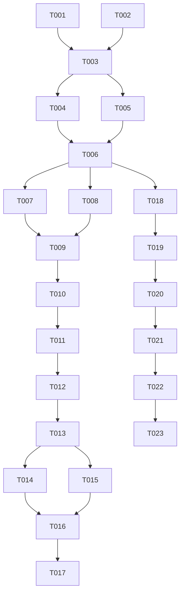

# Tasks List: transfer-calculator

Este documento contiene la lista de tareas ordenadas por dependencias para la calculadora de traslados académicos, siguiendo el formato estricto de SDD Enterprise.

---

## Fase 1: Setup

- [x] T001 Corregir ruta de carga de parámetros en `zproyect/app.py`
- [x] T002 Corregir ruta de carga de parámetros en `zproyect/test/test_traslados.py`

---

## Fase 2: Fundacionales (Prerrequisitos de Arquitectura)

- [x] T003 Alinear resultados esperados y ciclos inexistentes en `.specify/memory/spec.md` y `.specify/memory/test-cases.md` con la matemática correcta del algoritmo v4
- [ ] T004 Refactorizar lógica de validaciones de `zproyect/traslados.py` hacia `zproyect/validation.py`
- [ ] T005 Refactorizar motor de cálculo de `zproyect/traslados.py` hacia `zproyect/calculator.py`

---

## Fase 3: User Story 1 (US-1: API de Cálculo Core)

* **Meta de la historia:** Exponer endpoint POST para calcular traslados de contado y cuotas.
* **Criterios de prueba:** Ejecutar suite de pruebas unitarias cubriendo TC-1, TC-2, TC-3, TC-9.

- [x] T006 [US1] Integrar el nuevo motor de cálculo en el endpoint `POST /api/traslados/calcular` de `zproyect/app.py` (nombre corregido 2026-07-07; el código real nunca usó `/api/transfer-calculator`)
- [ ] T007 [P] [US1] Crear pruebas unitarias para traslados CONTADO en `zproyect/test/test_traslados.py`
- [ ] T008 [P] [US1] Crear pruebas unitarias para traslados CUOTAS en `zproyect/test/test_traslados.py`

---

## Fase 4: User Story 2 (US-2: Validaciones en Cascada)

* **Meta de la historia:** Asegurar la correcta validación fail-fast antes de computar montos.
* **Criterios de prueba:** Validar TC-4, TC-5, TC-10 y obtener respuestas con error controlado.

- [ ] T009 [US2] Implementar validaciones en cascada de ciclos, modalidad de pago y rango de fechas en `zproyect/validation.py`
- [ ] T010 [P] [US2] Crear pruebas para flujos de error en `zproyect/test/test_traslados.py`

---

## Fase 5: User Story 3 (US-3: Desglose de Operaciones y Resumen)

* **Meta de la historia:** Devolver y mostrar el detalle de los cálculos de semanas y feriados.
* **Criterios de prueba:** Validar TC-6, TC-7, TC-8 y TC-11; verificar el texto plano copiado al portapapeles.

- [x] T011 [US3] Agregar desglose de semanas y feriados al JSON de respuesta en `zproyect/app.py` — satisfecha 2026-07-07 por T018/T019 (`detalle.origen/destino` con `pasos`); no fue necesario tocar `app.py` porque ya reenvía `resultado` completo.
- [ ] T012 [P] [US3] Implementar botón y lógica de copiado rápido de resumen en `zproyect/static/js/app.js`

---

## Fase 6: User Story 4 (US-4: Interfaz de Usuario Premium)

* **Meta de la historia:** Proveer una UI responsiva, de alta gama estética, interactiva y con alertas claras.
* **Criterios de prueba:** Pruebas visuales y de interacción en el navegador simulación de traslados exitosos y con alerta de saldo faltante.

- [x] T013 [US4] Diseñar maquetado HTML semántico y responsivo en `zproyect/templates/index.html`
- [x] T014 [US4] Desarrollar estilos CSS modernos (glassmorphism, degradados, fuentes premium, animaciones de botones) en `zproyect/static/css/styles.css`
- [x] T015 [US4] Conectar el formulario HTML con la API REST de cálculo en `zproyect/static/js/app.js`

---

## Fase 7: Pulido y Calidad

- [ ] T016 Validar formato PEP8 y corregir lints con ruff en todos los archivos python de `zproyect/`
- [ ] T017 Ejecutar pruebas de cobertura unitaria superiores al 80% sobre `zproyect/test/test_traslados.py`

---

## Fase 8: User Story 5 (US-5 / FR-010: Desglose estilo cálculo manual)

* **Meta de la historia:** El desglose de operaciones (US-3) debe narrar el cálculo como lo haría un analista a mano (semana por semana, cuota vigente y su periodo), no solo mostrar una resta final.
* **Criterios de prueba:** Validar AC-3.4 (CUOTAS) y AC-3.5 (CONTADO) de `spec.md`; corregir la aserción TC-3 rota en `test_traslados.py`.

- [x] T018 [US5] Implementar `generar_pasos_contado` y `generar_pasos_cuotas` en `zproyect/traslados.py`, reutilizando las funciones de cálculo existentes (sin duplicar fórmulas, Art. 4.4 de la constitución); corregir `detalle` de CUOTAS para que use las semanas del periodo de la cuota vigente en vez de las del ciclo completo. Verificado 2026-07-07: de paso se corrigió el mismo bug en CONTADO (`semanas_totales`/`semanas_restantes` usaban `duration_weeks` sin ajustar por feriados en vez de `semanas_efectivas`).
- [x] T019 [US5] Exponer `detalle.origen.pasos` / `detalle.destino.pasos` en la respuesta de `calcular_traslado()` (`zproyect/traslados.py`); no requiere cambios en `zproyect/app.py` porque el endpoint ya reenvía `resultado` completo.
- [x] T020 [US5] Corregir la aserción TC-3 obsoleta (esperaba 4080.00) en `zproyect/test/test_traslados.py` y agregar pruebas para AC-3.4/AC-3.5 (los dos ejemplos verificados: CUOTAS 25/03/2026 y CONTADO 15/05/2026 SEMIANUAL MARZO). Ejecutado `pytest -s` el 2026-07-07: las 33 verificaciones (`check()`) pasan, incluyendo las 9 preexistentes que ya pasaban y las 15 nuevas. Pendiente aparte (no bloquea esta tarea): el archivo no define funciones `def test_*`, por lo que pytest reporta exit code 5 ("no tests ran") aunque todo pase — es un patrón preexistente del archivo, no introducido en esta sesión.

---

## Fase 9: User Story 6 (US-6 / FR-011: campos estructurados de periodo y semana actual)

* **Meta de la historia:** exponer `fecha_inicio_periodo`, `fecha_fin_periodo`, `semana_actual` como campos independientes del `detalle`, no solo embebidos en `pasos`.
* **Criterios de prueba:** AC-3.6 (CONTADO), AC-3.7 (CUOTAS), AC-3.8 (simetría origen/destino), CB-8, CB-9, CB-10.
* **Producida vía SDD Enterprise real:** `spec.md` (Requirement Analyst, subagente real) → `plan.md` ADR-4 (Architect, subagente real) → implementación → tests → Review (subagente real). Ver `decisions.md`, entrada 2026-07-07 "FR-011", para el registro completo de la ejecución.

- [x] T021 [US6] Agregar helper `_fmt_fecha_opt` y extender `generar_pasos_contado`/`generar_pasos_cuotas` en `zproyect/traslados.py` con los 3 campos nuevos, siguiendo ADR-4. Verificado 2026-07-07 ejecutando `calcular_traslado()` contra AC-3.6/AC-3.7/CB-9/CB-10 con valores exactos.
- [x] T022 [US6] Agregar tests para AC-3.6, AC-3.7, AC-3.8, CB-8, CB-9, CB-10 en `zproyect/test/test_traslados.py`. `pytest -s`: 49 verificaciones `check()`, todas OK (2026-07-07).
- [x] T023 [US6] Ejecutado el agente Review (pasada trivial-complexity combinada) sobre la implementación real — verdicto inicial **APPROVED WITH CONDITIONS**: encontró vía mutation testing que el test original de CB-10 no forzaba el clamp con datos reales de `parameters.json` (ningún ciclo real lo activa). Se agregó un caso sintético que sí lo fuerza (confirmado con mutation test propio: al quitar el clamp, el nuevo test falla; restaurado, todo pasa). Con eso, la condición del Review queda resuelta. Ver `decisions.md`, entrada "FR-011", para el reporte completo del Review.

---

## Fase 10: Mantenimiento

- [x] T024 Agregar `sys.path.insert` en `zproyect/test/test_traslados.py` para que corra con `python test_traslados.py` directo (sin depender de `python -m pytest` ni del directorio actual). Verificado 2026-07-07 ejecutándolo desde `zproyect/test/` y desde `zproyect/`, ambos OK; `pytest` normal sigue funcionando igual (sin regresión).

---

## Grafo de Dependencia

