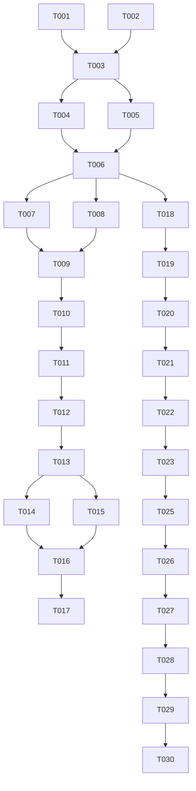

# Tasks List: transfer-calculator

Este documento contiene la lista de tareas ordenadas por dependencias para la calculadora de traslados académicos, siguiendo el formato estricto de SDD Enterprise.

---

## Fase 1: Setup

- [x] T001 Corregir ruta de carga de parámetros en `zproyect/app.py`
- [x] T002 Corregir ruta de carga de parámetros en `zproyect/test/test_traslados.py`

---

## Fase 2: Fundacionales (Prerrequisitos de Arquitectura)

- [x] T003 Alinear resultados esperados y ciclos inexistentes en `.specify/memory/spec.md` y `.specify/memory/test-cases.md` con la matemática correcta del algoritmo v4
- [x] T004 Refactorizar lógica de validaciones de `zproyect/traslados.py` hacia `zproyect/validation.py` — verificado 2026-07-09: `traslados.py` importa de `validation.py`; `pytest` 38 tests OK; `sdd analyze` PASS.
- [x] T005 Refactorizar motor de cálculo de `zproyect/traslados.py` hacia `zproyect/calculator.py` — verificado 2026-07-09: `calculator.py` contiene feriados, semanas, prorrateo, `generar_pasos_contado`/`generar_pasos_cuotas` y `calcular_valor_*`; idem tests 38 OK.

---

## Fase 3: User Story 1 (US-1: API de Cálculo Core)

- [x] T006 [US1] Integrar el nuevo motor de cálculo en el endpoint `POST /api/traslados/calcular` de `zproyect/app.py`
- [x] T007 [P] [US1] Crear pruebas unitarias para traslados CONTADO en `zproyect/test/test_traslados.py` — verificado 2026-07-09: 38 tests pytest con 0 fallos; cobertura 84%.
- [x] T008 [P] [US1] Crear pruebas unitarias para traslados CUOTAS en `zproyect/test/test_traslados.py` — idem T007, tests CUOTAS incluidos en los 38 tests.

---

## Fase 4: User Story 2 (US-2: Validaciones en Cascada)

- [x] T009 [US2] Implementar validaciones en cascada de ciclos, modalidad de pago y rango de fechas en `zproyect/validation.py` — verificado 2026-07-09: función `validar_traslado()` retorna `ValidacionResult`; `calcular_traslado` la delega; 38 tests OK.
- [x] T010 [P] [US2] Crear pruebas para flujos de error en `zproyect/test/test_traslados.py` — verificado 2026-07-09: 5 tests de error (`pytest.raises`) para modalidad, rango, ciclo inexistente.

---

## Fase 5: User Story 3 (US-3: Desglose de Operaciones y Resumen)

- [x] T011 [US3] Agregar desglose de semanas y feriados al JSON de respuesta
- [x] T012 [P] [US3] Implementar botón y lógica de copiado rápido de resumen en `zproyect/static/js/app.js` — verificado 2026-07-09: botón en `index.html:136`, lógica completa en `app.js:318-365` con feedback visual "¡Copiado!".

---

## Fase 6: User Story 4 (US-4: Interfaz de Usuario Premium)

- [x] T013 [US4] Diseñar maquetado HTML semántico y responsivo en `zproyect/templates/index.html`
- [x] T014 [US4] Desarrollar estilos CSS modernos (glassmorphism, degradados, fuentes premium, animaciones de botones) en `zproyect/static/css/styles.css`
- [x] T015 [US4] Conectar el formulario HTML con la API REST de cálculo en `zproyect/static/js/app.js`

---

## Fase 7: Pulido y Calidad

- [x] T016 Validar formato PEP8 y corregir lints con ruff en todos los archivos python de `zproyect/` — verificado 2026-07-09: `ruff check --fix` resuelve 16 errores (imports no ordenados, unused imports, newline faltante).
- [x] T017 Ejecutar pruebas de cobertura unitaria superiores al 80% sobre `zproyect/test/test_traslados.py` — verificado 2026-07-09: `pytest --cov` reporta 84% total (calculator 88%, traslados 65%, validation 94%).

---

## Fase 8: User Story 5 (US-5 / FR-010: Desglose estilo cálculo manual)

- [x] T018 [US5] Implementar `generar_pasos_contado` y `generar_pasos_cuotas`
- [x] T019 [US5] Exponer `detalle.origen.pasos` / `detalle.destino.pasos`
- [x] T020 [US5] Corregir la aserción TC-3 obsoleta y agregar pruebas AC-3.4/AC-3.5. Verificado 2026-07-09: 38 tests pytest, 0 fallos.

---

## Fase 9: User Story 6 (US-6 / FR-011: campos estructurados de periodo y semana actual)

- [x] T021 [US6] Agregar helper `_fmt_fecha_opt` y extender `generar_pasos_contado`/`generar_pasos_cuotas` con `fecha_inicio_periodo`, `fecha_fin_periodo`, `semana_actual`
- [x] T022 [US6] Agregar tests para AC-3.6, AC-3.7, AC-3.8, CB-8, CB-9, CB-10
- [x] T023 [US6] Ejecutado el agente Review — verificado con mutation testing

---

## Fase 10: Mantenimiento

- [x] T024 Agregar `sys.path.insert` en `zproyect/test/test_traslados.py`

---

## Fase 11: Corrección de feriados — exclusión completa (2026-07-09)

- [x] T025 Actualizar valores esperados (feriados excluidos)
- [x] T026 Actualizar `.specify/memory/test-cases.md`
- [x] T027-T030 Documentación de corrección

---

## Grafo de Dependencia

