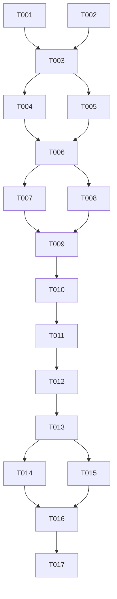

# Tasks List: transfer-calculator

Este documento contiene la lista de tareas ordenadas por dependencias para la calculadora de traslados académicos, siguiendo el formato estricto de SDD Enterprise.

---

## Fase 1: Setup

- [x] T001 Corregir ruta de carga de parámetros en `zproyect/app.py`
- [x] T002 Corregir ruta de carga de parámetros en `zproyect/test/test_traslados.py`

---

## Fase 2: Fundacionales (Prerrequisitos de Arquitectura)

- [x] T003 Alinear resultados esperados y ciclos inexistentes en `.specify/memory/spec.md` y `.specify/memory/test-cases.md` con la matemática correcta del algoritmo v4
- [ ] T004 Refactorizar lógica de validaciones de `zproyect/traslados.py` hacia `zproyect/validation.py`
- [ ] T005 Refactorizar motor de cálculo de `zproyect/traslados.py` hacia `zproyect/calculator.py`

---

## Fase 3: User Story 1 (US-1: API de Cálculo Core)

* **Meta de la historia:** Exponer endpoint POST para calcular traslados de contado y cuotas.
* **Criterios de prueba:** Ejecutar suite de pruebas unitarias cubriendo TC-1, TC-2, TC-3, TC-9.

- [x] T006 [US1] Integrar el nuevo motor de cálculo en el endpoint `POST /api/transfer-calculator` de `zproyect/app.py`
- [ ] T007 [P] [US1] Crear pruebas unitarias para traslados CONTADO en `zproyect/test/test_traslados.py`
- [ ] T008 [P] [US1] Crear pruebas unitarias para traslados CUOTAS en `zproyect/test/test_traslados.py`

---

## Fase 4: User Story 2 (US-2: Validaciones en Cascada)

* **Meta de la historia:** Asegurar la correcta validación fail-fast antes de computar montos.
* **Criterios de prueba:** Validar TC-4, TC-5, TC-10 y obtener respuestas con error controlado.

- [ ] T009 [US2] Implementar validaciones en cascada de ciclos, modalidad de pago y rango de fechas en `zproyect/validation.py`
- [ ] T010 [P] [US2] Crear pruebas para flujos de error en `zproyect/test/test_traslados.py`

---

## Fase 5: User Story 3 (US-3: Desglose de Operaciones y Resumen)

* **Meta de la historia:** Devolver y mostrar el detalle de los cálculos de semanas y feriados.
* **Criterios de prueba:** Validar TC-6, TC-7, TC-8 y TC-11; verificar el texto plano copiado al portapapeles.

- [ ] T011 [US3] Agregar desglose de semanas y feriados al JSON de respuesta en `zproyect/app.py`
- [ ] T012 [P] [US3] Implementar botón y lógica de copiado rápido de resumen en `zproyect/static/js/app.js`

---

## Fase 6: User Story 4 (US-4: Interfaz de Usuario Premium)

* **Meta de la historia:** Proveer una UI responsiva, de alta gama estética, interactiva y con alertas claras.
* **Criterios de prueba:** Pruebas visuales y de interacción en el navegador simulación de traslados exitosos y con alerta de saldo faltante.

- [x] T013 [US4] Diseñar maquetado HTML semántico y responsivo en `zproyect/templates/index.html`
- [x] T014 [US4] Desarrollar estilos CSS modernos (glassmorphism, degradados, fuentes premium, animaciones de botones) en `zproyect/static/css/styles.css`
- [x] T015 [US4] Conectar el formulario HTML con la API REST de cálculo en `zproyect/static/js/app.js`

---

## Fase 7: Pulido y Calidad

- [ ] T016 Validar formato PEP8 y corregir lints con ruff en todos los archivos python de `zproyect/`
- [ ] T017 Ejecutar pruebas de cobertura unitaria superiores al 80% sobre `zproyect/test/test_traslados.py`

---

## Grafo de Dependencia

