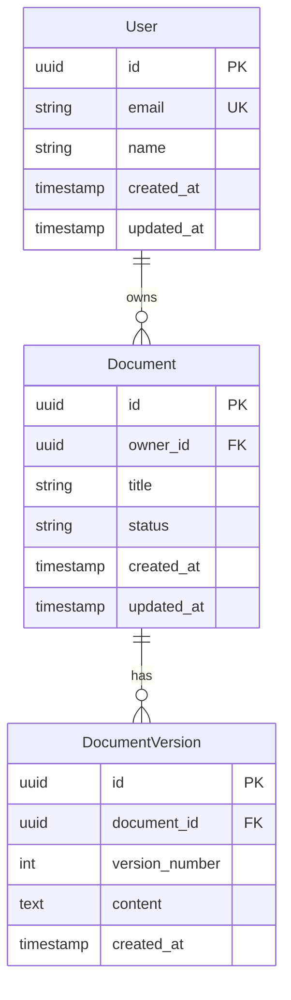

# Data Model: [FEATURE_NAME]

**Feature ID:** [NNN]-[feature-slug]
**Created:** [DATE]
**Status:** Draft | Under Review | Approved

---

## 1. Entity Relationship Diagram



---

## 2. Entity Definitions

### 2.1 Entity: [Entity Name]

**Description:** [What this entity represents]

**Table:** `[table_name]`

| Column | Type | Constraints | Description |
|--------|------|-------------|-------------|
| `id` | UUID | PK | Unique identifier |
| `[column_name]` | [type] | [constraints] | [description] |
| `created_at` | TIMESTAMP | NOT NULL, DEFAULT NOW() | Creation timestamp |
| `updated_at` | TIMESTAMP | NOT NULL | Last update timestamp |

**Indexes:**
- `idx_[table]_[column]` - [Purpose]
- `idx_[table]_[column1]_[column2]` - [Purpose]

**Relationships:**
- `[relationship_name]` → `[target_table]` (type: [1:1/1:N/N:M])

### 2.2 Entity: [Entity Name 2]

**Description:** [What this entity represents]

**Table:** `[table_name]`

| Column | Type | Constraints | Description |
|--------|------|-------------|-------------|
| `id` | UUID | PK | Unique identifier |
| `[column_name]` | [type] | [constraints] | [description] |

---

## 3. Enumerations

### 3.1 [Enum Name]

**Used in:** `[table].[column]`

| Value | Description |
|-------|-------------|
| `[VALUE_1]` | [Description] |
| `[VALUE_2]` | [Description] |
| `[VALUE_3]` | [Description] |

---

## 4. Data Validation Rules

| Entity | Field | Rule | Error Message |
|--------|-------|------|---------------|
| [Entity] | [field] | [validation rule] | [error message] |
| [Entity] | [field] | [validation rule] | [error message] |

---

## 5. Migration Plan

### 5.1 New Tables

```sql
-- Migration: Create [table_name]
CREATE TABLE [table_name] (
    id UUID PRIMARY KEY DEFAULT gen_random_uuid(),
    -- columns...
    created_at TIMESTAMP NOT NULL DEFAULT NOW(),
    updated_at TIMESTAMP NOT NULL DEFAULT NOW()
);

CREATE INDEX idx_[table]_[column] ON [table_name]([column]);
```

### 5.2 Schema Changes

| Change Type | Table | Change | Rollback |
|-------------|-------|--------|----------|
| ADD COLUMN | [table] | [column details] | DROP COLUMN |
| ADD INDEX | [table] | [index details] | DROP INDEX |

### 5.3 Data Migration

```sql
-- Data migration (if needed)
UPDATE [table] SET [column] = [value] WHERE [condition];
```

---

## 6. Seed Data

### 6.1 Required Seed Data

| Table | Data | Purpose |
|-------|------|---------|
| [table] | [data description] | [purpose] |

### 6.2 Test Data

| Table | Records | Purpose |
|-------|---------|---------|
| [table] | [count] | [purpose] |

---

## 7. Performance Considerations

### 7.1 Expected Data Volume

| Table | Initial | Year 1 | Year 3 |
|-------|---------|--------|--------|
| [table] | [count] | [count] | [count] |

### 7.2 Query Patterns

| Query | Frequency | Indexes Used |
|-------|-----------|--------------|
| [describe query] | [per second/minute] | [index names] |

### 7.3 Partitioning Strategy

- **Table:** [table if needed]
- **Strategy:** [Range/Hash/List]
- **Partition Key:** [column]

---

## 8. Data Privacy

### 8.1 PII Fields

| Table | Column | Classification | Handling |
|-------|--------|----------------|----------|
| [table] | [column] | PII | Encrypted at rest |
| [table] | [column] | Sensitive | Access logged |

### 8.2 Retention Policy

| Table | Retention Period | Archive Strategy |
|-------|-----------------|------------------|
| [table] | [period] | [strategy] |

---

## 9. Prisma Schema (if applicable)

```prisma
// schema.prisma

model User {
  id        String   @id @default(uuid())
  email     String   @unique
  name      String
  documents Document[]
  createdAt DateTime @default(now()) @map("created_at")
  updatedAt DateTime @updatedAt @map("updated_at")
  
  @@map("users")
}

model Document {
  id        String   @id @default(uuid())
  title     String
  status    DocumentStatus @default(DRAFT)
  owner     User     @relation(fields: [ownerId], references: [id])
  ownerId   String   @map("owner_id")
  versions  DocumentVersion[]
  createdAt DateTime @default(now()) @map("created_at")
  updatedAt DateTime @updatedAt @map("updated_at")
  
  @@index([ownerId])
  @@map("documents")
}

enum DocumentStatus {
  DRAFT
  PUBLISHED
  ARCHIVED
}
```

---

## 10. Sign-off

- [ ] Data Architect: _________________ Date: _______
- [ ] DBA Review: _________________ Date: _______
