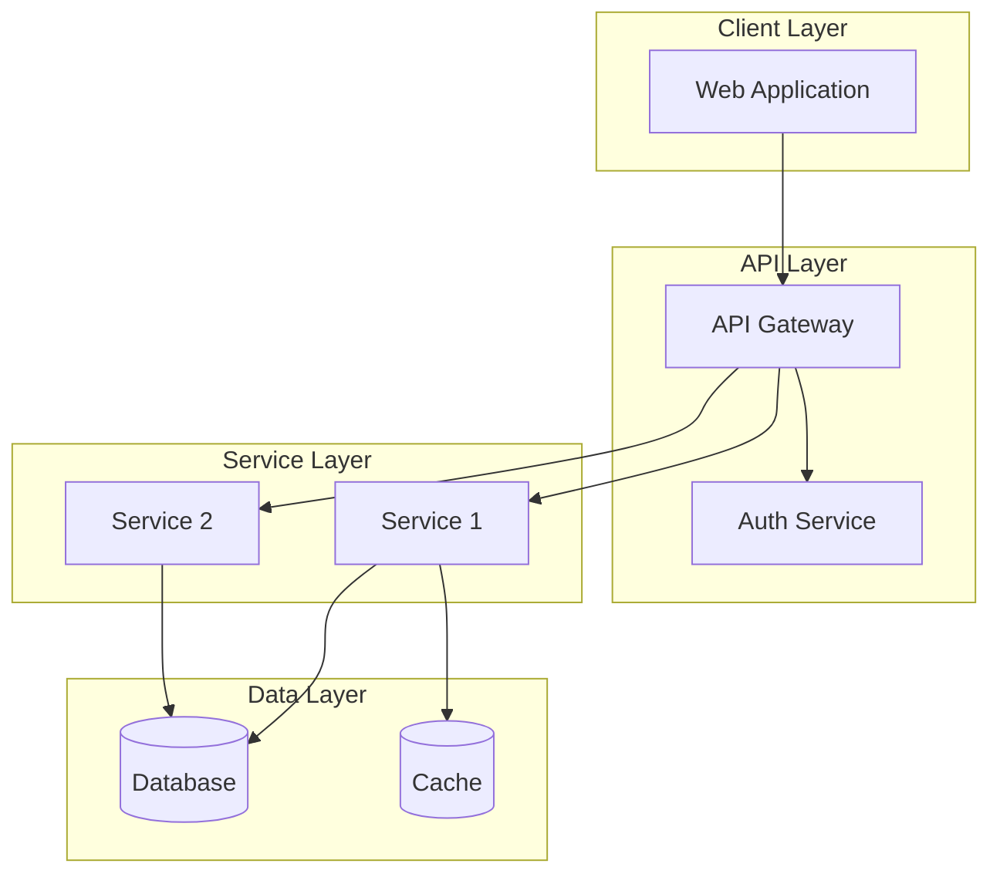

# Solution Design: [FEATURE_NAME]

**Feature ID:** [NNN]-[feature-slug]
**Created:** [DATE]
**Architect:** [Name]
**Status:** Draft | Under Review | Approved

---

## 1. Architecture Overview

### 1.1 High-Level Diagram



### 1.2 Architecture Decision Summary

| Decision | Choice | Rationale |
|----------|--------|-----------|
| [Decision 1] | [Choice] | [Why] |
| [Decision 2] | [Choice] | [Why] |

---

## 2. Component Design

### 2.1 Component: [Component Name]

**Responsibility:** [What this component does]

**Interfaces:**
- `[Interface 1]` - [Description]
- `[Interface 2]` - [Description]

**Dependencies:**
- [Dependency 1] - [Purpose]
- [Dependency 2] - [Purpose]

**Key Classes/Modules:**

> **Note:** The example below uses a TypeScript project structure. Adapt to your project's language and framework as defined in the constitution (Article II).

```
ComponentName/
├── index.ts           # Public exports
├── component.service.ts
├── component.controller.ts
├── component.repository.ts
└── dto/
    ├── create-component.dto.ts
    └── update-component.dto.ts
```

### 2.2 Component: [Component Name 2]

**Responsibility:** [What this component does]

**Interfaces:**
- `[Interface 1]` - [Description]

**Dependencies:**
- [Dependency 1] - [Purpose]

---

## 3. Data Model

See: [data-model.md](./data-model.md)

### 3.1 Summary

| Entity | Description | Key Relationships |
|--------|-------------|-------------------|
| [Entity 1] | [Description] | [Relationships] |
| [Entity 2] | [Description] | [Relationships] |

---

## 4. API Design

### 4.1 Endpoints Summary

| Method | Path | Description | Auth Required |
|--------|------|-------------|---------------|
| POST | `/api/v1/[resource]` | Create resource | Yes |
| GET | `/api/v1/[resource]` | List resources | Yes |
| GET | `/api/v1/[resource]/:id` | Get resource | Yes |
| PUT | `/api/v1/[resource]/:id` | Update resource | Yes |
| DELETE | `/api/v1/[resource]/:id` | Delete resource | Yes |

See: [contracts/openapi.yaml](./contracts/openapi.yaml)

---

## 5. Security Considerations

### 5.1 Authentication

- **Method:** [OAuth2/JWT/Session]
- **Token Location:** [Header/Cookie]
- **Expiration:** [Duration]

### 5.2 Authorization

| Resource | Action | Required Role/Permission |
|----------|--------|-------------------------|
| [Resource 1] | Read | [Role] |
| [Resource 1] | Write | [Role] |
| [Resource 2] | Read | [Role] |

### 5.3 Data Protection

- **Encryption at Rest:** [Yes/No - Method]
- **Encryption in Transit:** [TLS version]
- **PII Fields:** [List of fields requiring special handling]

### 5.4 Security Threats

| Threat | Mitigation |
|--------|------------|
| [Threat 1] | [How we address it] |
| [Threat 2] | [How we address it] |

---

## 6. Performance Considerations

### 6.1 Performance Requirements

| Metric | Target | Strategy |
|--------|--------|----------|
| Response Time (p95) | [X]ms | [Strategy] |
| Throughput | [X] req/s | [Strategy] |
| Concurrent Users | [X] | [Strategy] |

### 6.2 Optimization Strategies

- **Caching:** [What/Where/TTL]
- **Database:** [Indexes, query optimization]
- **Async Processing:** [What goes to queue]

---

## 7. Integration Points

### 7.1 External Services

| Service | Purpose | Integration Method | Error Handling |
|---------|---------|-------------------|----------------|
| [Service 1] | [Purpose] | REST API | [Strategy] |
| [Service 2] | [Purpose] | Event | [Strategy] |

### 7.2 Internal Services

| Service | Purpose | Contract |
|---------|---------|----------|
| [Service 1] | [Purpose] | [Link to contract] |

---

## 8. Error Handling

### 8.1 Error Categories

| Category | HTTP Code | Handling |
|----------|-----------|----------|
| Validation | 400 | Return field errors |
| Authentication | 401 | Redirect to login |
| Authorization | 403 | Return forbidden |
| Not Found | 404 | Return not found |
| Business Logic | 422 | Return business error |
| Internal | 500 | Log + generic message |

### 8.2 Retry Strategy

| Operation | Retries | Backoff | Circuit Breaker |
|-----------|---------|---------|-----------------|
| [Operation 1] | [N] | [Strategy] | [Yes/No] |

---

## 9. Testing Strategy

### 9.1 Test Levels

| Level | Scope | Coverage Target |
|-------|-------|-----------------|
| Unit | Components | 80% |
| Integration | APIs | Key paths |
| E2E | User flows | Happy paths |

### 9.2 Test Data

- **Fixtures:** [Location]
- **Factories:** [Location]
- **Mocks:** [External services to mock]

---

## 10. Deployment Considerations

### 10.1 Environment Variables

| Variable | Description | Required |
|----------|-------------|----------|
| `DATABASE_URL` | Database connection | Yes |
| `API_SECRET` | API signing key | Yes |

### 10.2 Database Migrations

- **Migration Tool:** [Prisma/Flyway/etc.]
- **Rollback Strategy:** [Strategy]

### 10.3 Feature Flags

| Flag | Purpose | Default |
|------|---------|---------|
| [Flag 1] | [Purpose] | [Value] |

---

## 11. Observability

### 11.1 Logging

| Event | Level | Data |
|-------|-------|------|
| [Event 1] | INFO | [Fields] |
| [Event 2] | ERROR | [Fields] |

### 11.2 Metrics

| Metric | Type | Purpose |
|--------|------|---------|
| [Metric 1] | Counter | [Purpose] |
| [Metric 2] | Histogram | [Purpose] |

### 11.3 Alerts

| Condition | Severity | Action |
|-----------|----------|--------|
| [Condition 1] | Critical | [Action] |
| [Condition 2] | Warning | [Action] |

---

## 12. Open Issues

| ID | Issue | Resolution Path | Owner |
|----|-------|-----------------|-------|
| [1] | [Issue] | [Path] | [Owner] |

---

## 13. Synthesis Assessment

### Generalization
> [1-sentence: Can patterns in this design be reused across other features or projects?]

### Build-vs-Adopt
> [1-sentence: For each major component, should we build custom or adopt an existing library/service?]

### Simplification
> [1-sentence: Can this design be simpler without sacrificing requirements?]

---

## 14. Sign-off

- [ ] Tech Lead: _________________ Date: _______
- [ ] Security Review: _________________ Date: _______
- [ ] Architecture Review: _________________ Date: _______

---

## External References

> Add one row per external source consulted during design (API specs, protocol RFCs, vendor documentation, regulatory requirements).
> See `source-verification.instructions.md` for the DETECT→FETCH→IMPLEMENT→CITE workflow.

| Source | Access Date | Relevant Section | Notes |
|--------|:-----------:|-----------------|-------|
| [URL or document ID] | [YYYY-MM-DD] | [Section / Version / Clause] | |
