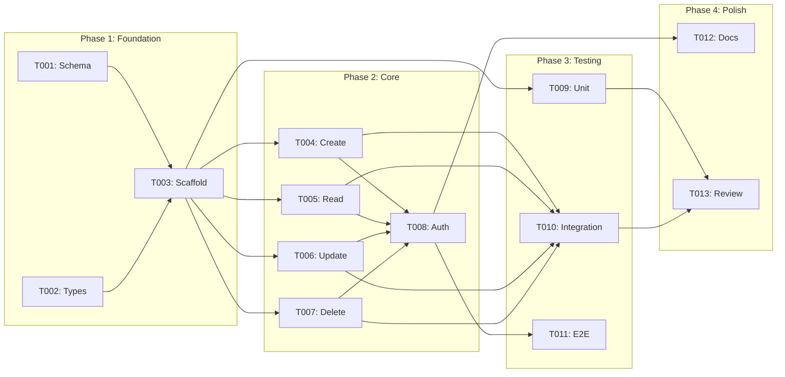

# Tasks: [FEATURE_NAME]

**Feature ID:** [NNN]-[feature-slug]
**Created:** [DATE]
**Status:** Planning | In Progress | Complete

---

## Summary

| Phase | Tasks | Estimated Hours | Status |
|-------|-------|-----------------|--------|
| Phase 1: Foundation | 3 | 8 | Not Started |
| Phase 2: Core Implementation | 5 | 16 | Not Started |
| Phase 3: Testing | 3 | 8 | Not Started |
| Phase 4: Polish | 2 | 4 | Not Started |
| **Total** | **13** | **36** | |

**Legend:**
- `[P]` = Parallel-safe (can run with other [P] tasks)
- `[S]` = Sequential (depends on previous tasks)
- `[T]` = Test task (can run parallel to feature tasks)
- `_Boundary:_` = Component/module/layer this task may touch (for review boundary-violation detection)
- `_Depends:_` = Prerequisite task IDs that must complete first

---

## Phase 1: Foundation

### T001 [P] - Database Schema Setup

_Boundary: Database, PrismaSchema_
_Depends: —_

**Priority:** P1
**Estimated:** 2h
**Assignee:** [Name]
**Status:** Not Started

**Description:**
Create database migration for new entities

**Files to Create/Modify:**
- `prisma/migrations/[timestamp]_[feature_name]/migration.sql`
- `prisma/schema.prisma`

**Acceptance Criteria:**
- [ ] Migration creates all tables from data-model.md
- [ ] Indexes created for query patterns
- [ ] Migration is reversible
- [ ] Local database updated successfully

**Traces To:** data-model.md

---

### T002 [P] - Type Definitions

_Boundary: TypeDefinitions, DTOs_
_Depends: —_

**Priority:** P1
**Estimated:** 2h
**Assignee:** [Name]
**Status:** Not Started

**Description:**
Create TypeScript types and DTOs for the feature

**Files to Create/Modify:**
- `src/modules/[feature]/dto/create-[entity].dto.ts`
- `src/modules/[feature]/dto/update-[entity].dto.ts`
- `src/modules/[feature]/types/[feature].types.ts`

**Acceptance Criteria:**
- [ ] Types match data model
- [ ] DTOs include validation decorators
- [ ] All fields properly documented

**Traces To:** data-model.md, plan.md

---

### T003 [S] - Module Scaffolding

_Boundary: FeatureModule, AppModule_
_Depends: T001, T002_

**Priority:** P1
**Estimated:** 4h
**Assignee:** [Name]
**Status:** Not Started

**Description:**
Create NestJS module structure

**Files to Create/Modify:**
- `src/modules/[feature]/[feature].module.ts`
- `src/modules/[feature]/[feature].controller.ts`
- `src/modules/[feature]/[feature].service.ts`
- `src/modules/[feature]/[feature].repository.ts`

**Acceptance Criteria:**
- [ ] Module registered in app.module.ts
- [ ] Basic CRUD operations scaffolded
- [ ] Dependency injection configured

**Traces To:** plan.md Section 2

---

## Phase 2: Core Implementation

### T004 [P] - Implement Create Operation

_Boundary: FeatureController, FeatureService, FeatureRepository_
_Depends: T003_

**Priority:** P1
**Estimated:** 4h
**Assignee:** [Name]
**Status:** Not Started

**Description:**
Implement create endpoint with validation

**Files to Modify:**
- `src/modules/[feature]/[feature].controller.ts`
- `src/modules/[feature]/[feature].service.ts`
- `src/modules/[feature]/[feature].repository.ts`

**Acceptance Criteria:**
- [ ] POST endpoint working
- [ ] Input validation implemented
- [ ] Error handling for validation errors
- [ ] Returns created entity

**Traces To:** US-001, AC-001

---

### T005 [P] - Implement Read Operations

_Boundary: FeatureController, FeatureService_
_Depends: T003_

**Priority:** P1
**Estimated:** 3h
**Assignee:** [Name]
**Status:** Not Started

**Description:**
Implement GET endpoints (list and single)

**Files to Modify:**
- `src/modules/[feature]/[feature].controller.ts`
- `src/modules/[feature]/[feature].service.ts`

**Acceptance Criteria:**
- [ ] GET list with pagination working
- [ ] GET single by ID working
- [ ] 404 handling for not found
- [ ] Query filters implemented

**Traces To:** US-001, AC-002

---

### T006 [P] - Implement Update Operation

_Boundary: FeatureController, FeatureService_
_Depends: T003_

**Priority:** P1
**Estimated:** 3h
**Assignee:** [Name]
**Status:** Not Started

**Description:**
Implement PUT/PATCH endpoint

**Files to Modify:**
- `src/modules/[feature]/[feature].controller.ts`
- `src/modules/[feature]/[feature].service.ts`

**Acceptance Criteria:**
- [ ] PUT endpoint working
- [ ] Partial updates supported
- [ ] Validation on update
- [ ] 404 for non-existent ID

**Traces To:** US-002, AC-003

---

### T007 [P] - Implement Delete Operation

_Boundary: FeatureController, FeatureService_
_Depends: T003_

**Priority:** P2
**Estimated:** 2h
**Assignee:** [Name]
**Status:** Not Started

**Description:**
Implement DELETE endpoint

**Files to Modify:**
- `src/modules/[feature]/[feature].controller.ts`
- `src/modules/[feature]/[feature].service.ts`

**Acceptance Criteria:**
- [ ] DELETE endpoint working
- [ ] Soft delete if required
- [ ] 404 for non-existent ID
- [ ] Cascade handling

**Traces To:** US-002, AC-004

---

### T008 [S] - Authorization Implementation

_Boundary: FeatureController, AuthGuard_
_Depends: T004, T005, T006, T007_

**Priority:** P1
**Estimated:** 4h
**Assignee:** [Name]
**Status:** Not Started

**Description:**
Add authorization guards to all endpoints

**Files to Modify:**
- `src/modules/[feature]/[feature].controller.ts`
- `src/modules/[feature]/guards/[feature].guard.ts`

**Acceptance Criteria:**
- [ ] Auth guard on all endpoints
- [ ] Role-based access per plan.md
- [ ] 403 for unauthorized access
- [ ] Owner-only for specific operations

**Traces To:** NFR-002, plan.md Section 5

---

## Phase 3: Testing

### T009 [T] - Unit Tests

_Boundary: TestSuite_
_Depends: T003_

**Priority:** P1
**Estimated:** 4h
**Assignee:** [Name]
**Status:** Not Started

**Description:**
Write unit tests for service layer

**Files to Create:**
- `src/modules/[feature]/__tests__/[feature].service.spec.ts`

**Acceptance Criteria:**
- [ ] Service methods tested
- [ ] Edge cases covered
- [ ] >80% coverage
- [ ] Mocks for repository

**Traces To:** test-cases.md TC-001, TC-004

---

### T010 [T] - Integration Tests

_Boundary: TestSuite_
_Depends: T004, T005, T006, T007_

**Priority:** P1
**Estimated:** 3h
**Assignee:** [Name]
**Status:** Not Started

**Description:**
Write integration tests for API endpoints

**Files to Create:**
- `tests/integration/[feature].integration.spec.ts`

**Acceptance Criteria:**
- [ ] All CRUD endpoints tested
- [ ] Auth scenarios tested
- [ ] Error scenarios tested
- [ ] Database cleanup after tests

**Traces To:** test-cases.md TC-002, TC-006, TC-008

---

### T011 [T] - E2E Tests

_Boundary: TestSuite_
_Depends: T008_

**Priority:** P2
**Estimated:** 2h
**Assignee:** [Name]
**Status:** Not Started

**Description:**
Write E2E tests for critical flows

**Files to Create:**
- `tests/e2e/[feature].e2e.spec.ts`

**Acceptance Criteria:**
- [ ] Happy path tested
- [ ] Authentication flow tested
- [ ] Can run in CI

**Traces To:** test-cases.md TC-003

---

## Phase 4: Polish

### T012 [S] - Documentation

_Boundary: Documentation_
_Depends: T008_

**Priority:** P2
**Estimated:** 2h
**Assignee:** [Name]
**Status:** Not Started

**Description:**
Update API documentation

**Files to Modify:**
- `docs/api/[feature].md`
- `README.md`

**Acceptance Criteria:**
- [ ] OpenAPI spec updated
- [ ] README updated
- [ ] Examples provided

---

### T013 [S] - Code Review Fixes

_Boundary: AllModified_
_Depends: T009, T010_

**Priority:** P1
**Estimated:** 2h
**Assignee:** [Name]
**Status:** Not Started

**Description:**
Address code review feedback

**Acceptance Criteria:**
- [ ] All review comments addressed
- [ ] Tests still passing
- [ ] Documentation updated

---

## Dependencies Graph

---

## Progress Tracking

| Task | Status | Started | Completed | Notes |
|------|--------|---------|-----------|-------|
| T001 | Not Started | | | |
| T002 | Not Started | | | |
| T003 | Not Started | | | |
| T004 | Not Started | | | |
| T005 | Not Started | | | |
| T006 | Not Started | | | |
| T007 | Not Started | | | |
| T008 | Not Started | | | |
| T009 | Not Started | | | |
| T010 | Not Started | | | |
| T011 | Not Started | | | |
| T012 | Not Started | | | |
| T013 | Not Started | | | |
