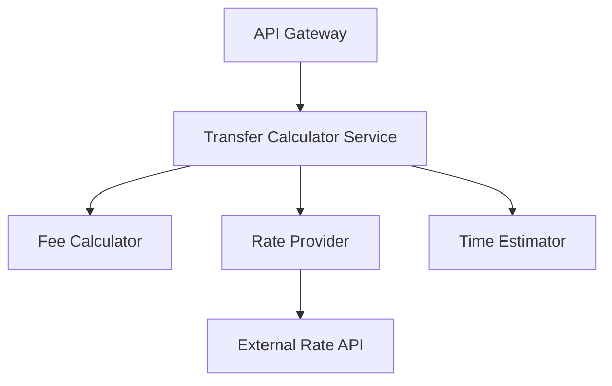

# Guía Completa de Enterprise SDD (Spec-Driven Development)

> **Versión:** 1.0  
> **Última actualización:** Julio 2026  
> **Propósito:** Documentar el flujo correcto de trabajo con SDD, incluyendo gates, agentes, CLI y mejores prácticas

---

## Tabla de Contenidos

1. [¿Qué es SDD?](#qué-es-sdd)
2. [Filosofía Core](#filosofía-core)
3. [Flujo de Trabajo Completo](#flujo-de-trabajo-completo)
4. [Quality Gates](#quality-gates)
5. [Sistema de Agentes](#sistema-de-agentes)
6. [CLI vs Agentes](#cli-vs-agentes)
7. [Niveles de Ceremonia](#niveles-de-ceremonia)
8. [Estructura de Directorios](#estructura-de-directorios)
9. [Ejemplo Práctico Completo](#ejemplo-práctico-completo)
10. [Comandos de Referencia Rápida](#comandos-de-referencia-rápida)
11. [Troubleshooting](#troubleshooting)

---

## ¿Qué es SDD?

**SDD (Spec-Driven Development)** es un framework de desarrollo de software que enfatiza:

- **Especificaciones primero**: Antes de escribir código, defines QUÉ vas a construir y POR QUÉ
- **Gates de calidad**: Puntos de control que validan que cada fase esté completa antes de avanzar
- **Agentes especializados**: Cada fase tiene agentes con roles específicos
- **Trazabilidad**: Cada línea de código traza hacia un requisito, caso de uso y tarea

### Diferencia con otros enfoques

| Enfoque | Problema | Solución SDD |
|---------|----------|--------------|
| Código primero | Retrabajo por malentendidos | Specs claras antes de implementar |
| Documentación estática | Se desactualiza | Gates que validan consistencia |
| Agentes genéricos | Falta de especialización | Agentes con roles específicos por fase |
| Salteo de fases | Deuda técnica acumulada | Gates obligatorios que no se pueden saltar |

---

## Filosofía Core

### Constitution-First

**Todo proyecto SDD comienza con una Constitución** en `.specify/memory/constitution.md`.

La constitución define:
- Stack tecnológico (lenguajes, frameworks, bases de datos)
- Estándares de calidad (coverage, linting, performance)
- Principios de arquitectura
- Lo que SIEMPRE se hace y lo que NUNCA se hace

> **Regla de oro:** Ningún agente puede violar la constitución. Si hay conflicto, se escala al humano.

### Gate-Driven

Cada fase tiene un **Gate** (puerta de calidad) que valida:
- Existencia de artefactos requeridos
- Consistencia entre artefactos
- Trazabilidad de requisitos

> **No se puede avanzar a la siguiente fase sin pasar el gate.**

### Agent-Based

Cada fase tiene **agentes especializados** con:
- Instrucciones específicas
- Herramientas permitidas
- Handoffs hacia otros agentes

---

## Flujo de Trabajo Completo

```
┌─────────────────────────────────────────────────────────────────────────┐
│                         FLUJO SDD ENTERPRISE                            │
└─────────────────────────────────────────────────────────────────────────┘

FASE 0: FOUNDATION
├── Constitution Agent (@constitution)
├── Output: constitution.md
└── Define: tech stack, quality standards, architecture principles

        ↓

FASE 1: VISION & SPEC
├── /speckit-specify o @requirement-analyst
├── Output: spec.md
└── Define: user stories, acceptance criteria, success metrics

        ↓

FASE 1.2: CLARIFICATION
├── /speckit-clarify o @clarification
├── Output: spec.md (actualizado)
└── Resolve: ambigüedades, preguntas de diseño

        ↓

═════════════════════════════════════════════════════════════════════════
                              GATE 1
  Valida: Spec completo, US definidas, AC claras, sin [NEEDS CLARIFICATION]
═════════════════════════════════════════════════════════════════════════

        ↓

FASE 2: DESIGN
├── /speckit-plan o @architect
├── Outputs: plan.md, data-model.md, contracts/, quickstart.md
└── Define: architecture, data model, API contracts, tech decisions

        ↓

FASE 2.1: API/Messaging Contracts (opcional)
├── @api-champion (REST APIs)
├── @messaging-champion (Async APIs)
└── Outputs: openapi.yaml, asyncapi.yaml

        ↓

═════════════════════════════════════════════════════════════════════════
                              GATE 2
  Valida: Diseño completo, arquitectura coherente, NFRs addressed
═════════════════════════════════════════════════════════════════════════

        ↓

FASE 3.1: TEST STRATEGY
├── @test-explorer o @gherkin-analyst
├── Output: test-cases.md, *.feature files
└── Define: test scenarios, acceptance tests

        ↓

FASE 3.2: TASKS
├── /speckit-tasks
├── Output: tasks.md
└── Generate: dependency-ordered task list

        ↓

═════════════════════════════════════════════════════════════════════════
                              GATE 3
  Valida: Tests definidos, tasks generados, ready for implementation
═════════════════════════════════════════════════════════════════════════

        ↓

FASE 4: IMPLEMENTATION
├── /speckit-implement o @software-engineer
├── Input: tasks.md, plan.md, spec.md
└── Execute: write code, make tests pass

        ↓

FASE 4.1: TEST ENGINEERING (paralelo)
├── @test-engineer
├── Output: unit tests, integration tests
└── Write: failing tests before implementation

        ↓

═════════════════════════════════════════════════════════════════════════
                              GATE 4
  Valida: All tests passing, code review done, integration tests pass
═════════════════════════════════════════════════════════════════════════

        ↓

FASE 5: SHIP
├── @review (code review)
├── Deploy & Release
└── Merge to main
```

---

## Quality Gates

### ¿Qué es un Gate?

Un **Gate** es un punto de control obligatorio que valida que una fase está completa antes de pasar a la siguiente.

### Los 4 Gates de SDD

| Gate | Ubicación | Valida | Comando |
|------|-----------|--------|---------|
| **Gate 1** | Post-Clarification | Spec completa, US definidas, AC claras | `sdd gate check 1 -f <feature>` |
| **Gate 2** | Post-Design | Arquitectura, data model, contratos | `sdd gate check 2 -f <feature>` |
| **Gate 3** | Pre-Implementation | Tests, tasks, ready to code | `sdd gate check 3 -f <feature>` |
| **Gate 4** | Pre-Ship | Tests passing, review done | `sdd gate check 4 -f <feature>` |

### Detalle de cada Gate

#### Gate 1: Spec Completeness

**Valida:**
- ✅ Existe `spec.md`
- ✅ User Stories definidas con formato `US-XXX`
- ✅ Acceptance Criteria definidas con formato `AC-XXX`
- ✅ No quedan marcadores `[NEEDS CLARIFICATION]`
- ✅ Success criteria son medibles y technology-agnostic
- ✅ Edge cases identificados

**Comando:**
```bash
sdd gate check 1 -f transfer-calculator
# O con PowerShell:
.specify/scripts/powershell/validate-gate.ps1 -Gate 1 -Feature transfer-calculator
```

**Si falla:**
- Ejecutar `/speckit-clarify` para resolver ambigüedades
- Actualizar `spec.md` con detalles faltantes

---

#### Gate 2: Design Completeness

**Valida:**
- ✅ Existe `plan.md` con arquitectura
- ✅ Tech stack definido (languages, frameworks, databases)
- ✅ `data-model.md` completo (si aplica)
- ✅ Contratos definidos (`contracts/openapi.yaml` o similar)
- ✅ Non-functional requirements addressed
- ✅ Constitution check passed

**Comando:**
```bash
sdd gate check 2 -f transfer-calculator
```

**Si falla:**
- Ejecutar `/speckit-plan` o invocar `@architect`
- Completar artefactos de diseño faltantes

---

#### Gate 3: Implementation Readiness

**Valida:**
- ✅ `tasks.md` generado con tareas ordenadas por dependencia
- ✅ Cada tarea tiene: ID (T001), descripción, file path
- ✅ Tests definidos (`test-cases.md` o `*.feature`)
- ✅ Dependencias entre tareas documentadas
- ✅ Tareas marcadas como `[P]` (parallel) o `[S]` (sequential)

**Comando:**
```bash
sdd gate check 3 -f transfer-calculator
```

**Si falla:**
- Ejecutar `/speckit-tasks` para generar task breakdown
- Ejecutar `@test-explorer` para definir test strategy

---

#### Gate 4: Ship Readiness

**Valida:**
- ✅ Todas las tareas en `tasks.md` marcadas `[X]`
- ✅ Todos los tests pasan
- ✅ Coverage >= threshold definido en constitution
- ✅ Code review completado
- ✅ Integration tests pasan
- ✅ No hay regresiones

**Comando:**
```bash
sdd gate check 4 -f transfer-calculator
```

**Si falla:**
- Ejecutar tests: `npm test` o equivalente
- Ejecutar `@review` para code review
- Completar tareas pendientes

---

### Validar todos los gates

```bash
# Validar todos los gates hasta el actual
sdd gate validate transfer-calculator

# Ver status completo
sdd status transfer-calculator
```

---

## Sistema de Agentes

### Agentes por Fase

```
FASE 0 (Foundation)
└── @constitution
    └── Define tech stack, quality standards, architecture principles

FASE 1 (Vision & Spec)
├── @requirement-analyst
│   └── Captura requisitos de negocio
└── @clarification
    └── Resuelve ambigüedades en la spec

FASE 2 (Design)
├── @architect
│   └── Diseña arquitectura, data model, NFRs
├── @api-champion
│   └── Define REST API contracts (OpenAPI)
└── @messaging-champion
    └── Define async messaging contracts (AsyncAPI)

FASE 3 (Test & Tasks)
├── @test-explorer
│   └── Define test strategy
├── @gherkin-analyst
│   └── Escribe escenarios BDD/Gherkin
└── @test-engineer
    └── Implementa tests

FASE 4 (Implementation)
├── @software-engineer
│   └── Implementa features, hace pasar tests
└── @refactoring
    └── Refactors when needed

FASE 5 (Review & Ship)
├── @review
│   └── Code review, quality check
└── @analysis
    └── Post-mortem analysis
```

### Agentes Especializados

| Agente | Fase | Rol | Output Principal |
|--------|------|-----|------------------|
| `@constitution` | 0 | Define principios fundacionales | `constitution.md` |
| `@requirement-analyst` | 1 | Captura requisitos | `spec.md` |
| `@clarification` | 1.2 | Resuelve ambigüedades | `spec.md` (updated) |
| `@architect` | 2 | Diseña arquitectura | `plan.md`, `data-model.md` |
| `@api-champion` | 2.1 | Diseña APIs REST | `openapi.yaml` |
| `@messaging-champion` | 2.1 | Diseña mensajería async | `asyncapi.yaml` |
| `@test-explorer` | 3.1 | Define estrategia de tests | `test-cases.md` |
| `@gherkin-analyst` | 3.1 | Escribe escenarios BDD | `*.feature` |
| `@test-engineer` | 3.1/4 | Implementa tests | Test files |
| `@software-engineer` | 4 | Implementa código | Source code |
| `@review` | 5 | Code review | Review report |
| `@analysis` | 5 | Análisis post-mortem | Analysis doc |

### Agentes Meta (sdd-evolution module)

Estos agentes crean/modifican otros agentes:

- `@agent-builder` - Crea nuevos agentes
- `@instruction-builder` - Crea instrucciones
- `@prompt-builder` - Crea prompts
- `@guidance-builder` - Crea guías
- `@workflow-builder` - Crea workflows

### Cómo invocar agentes

```bash
# En VS Code con GitHub Copilot:
@architect diseña la arquitectura para esta feature

# En Kiro:
usa el agente @architect para diseñar la arquitectura

# El agente cargará automáticamente:
# - Sus instrucciones específicas
# - Las herramientas permitidas
# - El contexto de la fase actual
```

---

## CLI vs Agentes

SDD ofrece dos formas de ejecutar el flujo:

### 1. CLI Commands (Speckit Skills)

**Cuándo usar:** Flujos automatizados, scripts CI/CD, comandos rápidos.

**Ventajas:**
- Repetible y automatizable
- Ideal para CI/CD
- Output estructurado (JSON disponible)
- Más rápido para tareas simples

**Comandos principales:**

```bash
# Flujo completo CLI
sdd init                        # Inicializar SDD en proyecto
sdd new <feature-id>            # Crear nueva feature
sdd specify <description>       # Crear spec desde descripción
sdd clarify                     # Resolver ambigüedades
sdd plan                        # Generar diseño
sdd tasks                       # Generar tareas
sdd implement                   # Ejecutar implementación
sdd gate check <1-4> -f <id>    # Validar gate
sdd status <feature-id>         # Ver estado
sdd bridge <feature-id>         # Generar context bridge
```

### 2. Agentes (Interactivo)

**Cuándo usar:** Decisiones complejas, diseño arquitectural, revisiones.

**Ventajas:**
- Interacción conversacional
- Mejor para decisiones de diseño
- Puede hacer preguntas de clarificación
- Más contexto y razonamiento

**Ejemplo de flujo con agentes:**

```
Tú: @constitution define la constitución para un proyecto de e-commerce

[Constitution Agent genera constitution.md]

Tú: @requirement-analyst captura los requisitos para un carrito de compras

[Requirement Analyst genera spec.md]

Tú: @clarification hay algo ambiguo en la spec?

[Clarification Agent hace preguntas y actualiza spec.md]

Tú: @architect diseña la arquitectura

[Architect genera plan.md, data-model.md]
```

### Mapeo CLI ↔ Agentes

| CLI Command | Agente Equivalente | Skill |
|-------------|---------------------|-------|
| `sdd specify` | `@requirement-analyst` | `/speckit-specify` |
| `sdd clarify` | `@clarification` | `/speckit-clarify` |
| `sdd plan` | `@architect` | `/speckit-plan` |
| `sdd tasks` | (automated) | `/speckit-tasks` |
| `sdd implement` | `@software-engineer` | `/speckit-implement` |

### ¿Cuál usar?

| Escenario | Recomendación |
|-----------|---------------|
| Proyecto nuevo, decisiones arquitecturales | **Agentes** |
| Bug fix simple, feature pequeña | **CLI** |
| CI/CD pipeline | **CLI** |
| Diseño de API compleja | **Agentes** (`@api-champion`) |
| Implementación directa de spec clara | **CLI** (`sdd implement`) |
| Code review | **Agentes** (`@review`) |

---

## Niveles de Ceremonia

SDD adapta el rigor del proceso según la complejidad de la feature:

### Niveles

| Nivel | Cuándo usar | Comportamiento |
|-------|-------------|----------------|
| `ultra-light` | Bug fixes, typos, config changes | Artefactos abreviados, gates relajados |
| `standard` | Features típicas | Pipeline completo, gates normales |
| `full` | Cambios arquitecturales, seguridad, cross-team | Pipeline completo + review estricto + checkpoints adicionales |

### Configuración

El nivel se configura en `.specify/specs/<feature-id>/.feature-meta.json`:

```json
{
  "featureId": "transfer-calculator",
  "ceremonyLevel": "standard",
  "created": "2026-07-08T10:30:00Z"
}
```

### Diferencias por nivel

| Aspecto | Ultra-Light | Standard | Full |
|---------|-------------|----------|------|
| Spec depth | Mínima | Completa | Completa + risk analysis |
| Clarification | Opcional | Recomendado | Obligatorio |
| Design artifacts | Simplificado | Completo | Completo + ADRs |
| Gate validation | Relaxed | Normal | Estricto |
| Review | Self-review | Peer review | Peer + security review |
| Per-task verification | No | No | Sí |

---

## Estructura de Directorios

```
project-root/
├── .specify/                    # Framework SDD
│   ├── memory/                  # Memoria persistente
│   │   ├── constitution.md      # Principios del proyecto
│   │   ├── active-context.json  # Feature activa
│   │   └── session-state.md     # Estado de sesión
│   │
│   ├── specs/                   # Especificaciones por feature
│   │   ├── 001-user-auth/
│   │   │   ├── spec.md          # Especificación
│   │   │   ├── clarifications.md
│   │   │   ├── plan.md          # Diseño técnico
│   │   │   ├── data-model.md
│   │   │   ├── tasks.md         # Lista de tareas
│   │   │   ├── test-cases.md
│   │   │   ├── contracts/
│   │   │   │   └── openapi.yaml
│   │   │   └── checklists/
│   │   │       └── requirements.md
│   │   │
│   │   └── 002-payment-integration/
│   │
│   ├── bridges/                 # Context bridges
│   │   └── 001-to-002-bridge.md
│   │
│   ├── templates/               # Plantillas
│   │   ├── spec-template.md
│   │   ├── plan-template.md
│   │   ├── tasks-template.md
│   │   └── data-model-template.md
│   │
│   └── scripts/                 # Scripts CLI
│       ├── powershell/          # Windows
│       └── bash/                # Linux/Mac
│
├── .github/                     # Agentes e instrucciones
│   ├── agents/                  # Definiciones de agentes
│   │   ├── constitution.agent.md
│   │   ├── architect.agent.md
│   │   ├── software-engineer.agent.md
│   │   └── ...
│   │
│   ├── instructions/            # Instrucciones compartidas
│   │   ├── anti-patterns.instructions.md
│   │   ├── ceremony-levels.instructions.md
│   │   └── ...
│   │
│   └── copilot-instructions.md  # Instrucciones globales
│
├── .agents/                     # Skills de Speckit
│   └── skills/
│       ├── speckit-specify/SKILL.md
│       ├── speckit-plan/SKILL.md
│       ├── speckit-tasks/SKILL.md
│       └── ...
│
├── .sdd-modules/                # Módulos instalables
│
└── src/                         # Código fuente
```

---

## Ejemplo Práctico Completo

### Escenario: Implementar una calculadora de transferencias

#### Paso 1: Inicializar SDD

```bash
# Si es proyecto nuevo
sdd init

# Esto crea:
# - .specify/ directory
# - Templates
# - Scripts
```

#### Paso 2: Crear la Constitución

**Opción A: Con CLI**
```bash
sdd constitution
```

**Opción B: Con Agente**
```
@constitution define la constitución para un sistema bancario de transferencias
```

**Output:** `.specify/memory/constitution.md`

```markdown
# Project Constitution: Transfer System

## Article II: Technology Stack
- Language: TypeScript 5.2
- Framework: NestJS 10
- Database: PostgreSQL 15
- Testing: Jest, Supertest

## Article III: Quality Standards
- Minimum Coverage: 80%
- API Response Time: p95 < 200ms
- Security: OWASP Top 10
```

#### Paso 3: Crear la Feature Spec

**Con CLI:**
```bash
sdd new transfer-calculator --description "Calculadora de comisiones y tiempos para transferencias bancarias internacionales"
```

**O con Skill:**
```
/speckit-specify Calculadora que permita a usuarios estimar comisiones, tiempos de procesamiento y tipos de cambio para transferencias internacionales entre diferentes países y bancos.
```

**Output:** `.specify/specs/transfer-calculator/spec.md`

```markdown
# Feature: Transfer Calculator

## User Stories

### US-001: Calculate Transfer Fees
**As a** bank customer
**I want to** calculate fees for international transfers
**So that** I know the total cost before initiating

**Acceptance Criteria:**
- AC-001: Display fee breakdown (bank fee, intermediary fee, exchange rate margin)
- AC-002: Support 50+ destination countries
- AC-003: Update rates in real-time
```

#### Paso 4: Clarificación

```bash
sdd clarify
# o
/speckit-clarify
```

El agente hará preguntas como:

```
Q1: ¿Cómo deben actualizarse los tipos de cambio?

**Recommended:** Option A - Real-time API with 5-minute cache

| Option | Description |
|--------|-------------|
| A | Real-time API with 5-minute cache |
| B | Daily batch update at market open |
| C | Manual update by admin |
```

#### Paso 5: Validar Gate 1

```bash
sdd gate check 1 -f transfer-calculator
```

**Output exitoso:**
```
✅ Gate 1 PASSED

Checked:
  ✅ spec.md exists
  ✅ User Stories defined (3 stories)
  ✅ Acceptance Criteria defined (12 criteria)
  ✅ No [NEEDS CLARIFICATION] markers
  ✅ Success criteria are measurable

Ready for: Phase 2 (Design)
```

**Si falla:**
```
❌ Gate 1 FAILED

Issues:
  ⚠ Missing: Edge cases not documented
  ⚠ Warning: AC-005 is not measurable ("fast response")

Run /speckit-clarify to resolve these issues.
```

#### Paso 6: Diseño

**Con CLI:**
```bash
sdd plan
# o
/speckit-plan
```

**Output:** `.specify/specs/transfer-calculator/plan.md`

```markdown
# Implementation Plan: Transfer Calculator

## Tech Stack
- Language: TypeScript
- Framework: NestJS
- Database: PostgreSQL
- Cache: Redis (for rate caching)

## Architecture



## Components
1. TransferCalculatorService - Main orchestration
2. FeeCalculator - Fee computation logic
3. RateProvider - Exchange rate integration
4. TimeEstimator - Processing time estimation
```

#### Paso 7: Validar Gate 2

```bash
sdd gate check 2 -f transfer-calculator
```

#### Paso 8: Generar Tareas

```bash
sdd tasks
# o
/speckit-tasks
```

**Output:** `.specify/specs/transfer-calculator/tasks.md`

```markdown
# Tasks: Transfer Calculator

## Phase 1: Setup
- [ ] T001 Create project structure per implementation plan
- [ ] T002 Configure TypeScript, ESLint, Prettier
- [ ] T003 Setup Jest testing framework

## Phase 2: Foundation
- [ ] T004 Create database schema for fee rules
- [ ] T005 [P] Setup Redis connection
- [ ] T006 [P] Configure rate API client

## Phase 3: US-001 Calculate Transfer Fees
- [ ] T007 [US1] Create FeeCalculatorService
- [ ] T008 [US1] Implement fee computation logic
- [ ] T009 [US1] Add exchange rate integration
- [ ] T010 [US1] Create /calculate endpoint
- [ ] T011 [US1] Write unit tests for FeeCalculator

## Phase 4: US-002 Time Estimation
...
```

#### Paso 9: Validar Gate 3

```bash
sdd gate check 3 -f transfer-calculator
```

#### Paso 10: Implementar

**Con CLI:**
```bash
sdd implement
# o
/speckit-implement
```

**Con Agente:**
```
@software-engineer implementa las tareas para transfer-calculator
```

El agente:
1. Lee `tasks.md`
2. Ejecuta tareas en orden
3. Escribe código
4. Corre tests
5. Marca tareas completadas `[X]`

#### Paso 11: Code Review

```
@review revisa la implementación de transfer-calculator
```

#### Paso 12: Validar Gate 4

```bash
sdd gate check 4 -f transfer-calculator
```

#### Paso 13: Ship

```bash
# Merge a main
git checkout main
git merge transfer-calculator

# O con worktrees
sdd worktree ship transfer-calculator
```

---

## Comandos de Referencia Rápida

### CLI Commands

```bash
# Setup
sdd init                          # Inicializar SDD
sdd new <feature-id>              # Crear nueva feature

# Flujo de desarrollo
sdd specify <description>         # Crear spec
sdd clarify                       # Clarificar ambigüedades
sdd plan                          # Generar diseño
sdd tasks                         # Generar tareas
sdd implement                     # Ejecutar implementación

# Gates
sdd gate check <1-4> -f <id>      # Validar gate específico
sdd gate validate <feature-id>    # Validar todos los gates

# Status y diagnóstico
sdd status <feature-id>           # Ver estado de feature
sdd analyze <feature-id>          # Analizar consistencia
sdd bridge <feature-id>           # Generar context bridge

# Módulos y extensiones
sdd module list                   # Listar módulos instalados
sdd module install <module>       # Instalar módulo
sdd extension validate            # Validar extensiones

# Memory
sdd memory status                 # Estado del sistema de memoria
sdd memory sync                   # Sincronizar archivos de memoria
sdd memory doctor                 # Diagnosticar problemas

# Autonomy
sdd autonomy status               # Estado de ejecución autónoma
```

### Skills (Slash Commands)

```
/speckit-specify <description>    # Crear spec
/speckit-clarify                  # Clarificar
/speckit-plan                     # Diseñar
/speckit-tasks                    # Generar tareas
/speckit-implement                # Implementar
/speckit-checklist                # Gestionar checklists
/speckit-analyze                  # Analizar consistencia
/speckit-constitution             # Actualizar constitución
```

### Agentes

```
# Foundation
@constitution                     # Crear/actualizar constitución

# Spec & Requirements
@requirement-analyst              # Capturar requisitos
@clarification                    # Resolver ambigüedades

# Design
@architect                        # Diseñar arquitectura
@api-champion                     # Diseñar REST APIs
@messaging-champion               # Diseñar mensajería async

# Testing
@test-explorer                    # Definir estrategia de tests
@gherkin-analyst                  # Escribir escenarios BDD
@test-engineer                    # Implementar tests

# Implementation
@software-engineer                # Implementar código
@refactoring                      # Refactorizar

# Review & Ship
@review                           # Code review
@analysis                         # Análisis post-mortem

# Specialized
@brainstorming                    # Sesiones de brainstorming
@tech-context-maintainer          # Mantener contexto técnico
```

### PowerShell Scripts (Windows)

```powershell
# Ejecutar directamente
.specify/scripts/powershell/init.ps1
.specify/scripts/powershell/new-feature.ps1 -FeatureId "001-user-auth"
.specify/scripts/powershell/validate-gate.ps1 -Gate 1 -Feature "transfer-calculator"
.specify/scripts/powershell/status.ps1 -Feature "transfer-calculator"
.specify/scripts/powershell/check-prerequisites.ps1 -Json
```

---

## Troubleshooting

### Problema: Gate falla con "Missing artifacts"

**Causa:** Faltan artefactos de fases anteriores.

**Solución:**
```bash
# Verificar qué falta
sdd status <feature-id>

# Generar artefactos faltantes
sdd plan    # si falta plan.md
sdd tasks   # si falta tasks.md
```

### Problema: "Constitution not found"

**Causa:** No se ha creado la constitución del proyecto.

**Solución:**
```bash
# Crear constitución
sdd constitution
# o
@constitution crea la constitución para este proyecto
```

### Problema: Tasks no se ejecutan

**Causa:** Dependencias circulares o tareas bloqueadas.

**Solución:**
```bash
# Verificar dependencias
sdd analyze <feature-id>

# Regenerar tasks
sdd tasks
```

### Problema: Tests fallan después de implementar

**Causa:** Tests escritos incorrectamente o implementación no cumple AC.

**Solución:**
```
# Invocar test engineer para revisar tests
@test-engineer revisa los tests fallidos para <feature-id>

# O invocar software engineer para revisar implementación
@software-engineer debug de tests fallidos
```

### Problema: Contexto perdido entre sesiones

**Causa:** Ventana de contexto excedida.

**Solución:**
```bash
# Generar context bridge antes de cerrar sesión
sdd bridge <feature-id>

# En nueva sesión, leer el bridge
cat .specify/bridges/<feature-id>-bridge.md
```

### Problema: "Ceremony level mismatch"

**Causa:** Feature requiere ceremony level diferente.

**Solución:**
```json
// Editar .specify/specs/<feature-id>/.feature-meta.json
{
  "ceremonyLevel": "full"  // cambiar de "standard" a "full"
}
```

---

## Apéndice: Artefactos por Fase

| Fase | Artefactos Requeridos | Artefactos Opcionales |
|------|----------------------|----------------------|
| 0 | `constitution.md` | - |
| 1 | `spec.md` | `business-context.md`, `clarifications.md` |
| 2 | `plan.md` | `data-model.md`, `contracts/`, `research.md`, `quickstart.md` |
| 3 | `tasks.md`, `test-cases.md` | `*.feature` (Gherkin), `checklists/` |
| 4 | Source code, tests | - |
| 5 | Review report | `post-mortem.md` |

---

## Referencias

- Constitution file: `.specify/memory/constitution.md`
- Feature specs: `.specify/specs/<feature-id>/`
- Agents: `.github/agents/`
- Instructions: `.github/instructions/`
- Skills: `.agents/skills/speckit-*/SKILL.md`
- Scripts: `.specify/scripts/README.md`

---

**Fin de la guía.**

Para preguntas o aclaraciones, consulta:
- `.github/copilot-instructions.md` - Instrucciones globales
- `.specify/scripts/README.md` - Catálogo de scripts
- `.agents/skills/*/SKILL.md` - Documentación de cada skill
